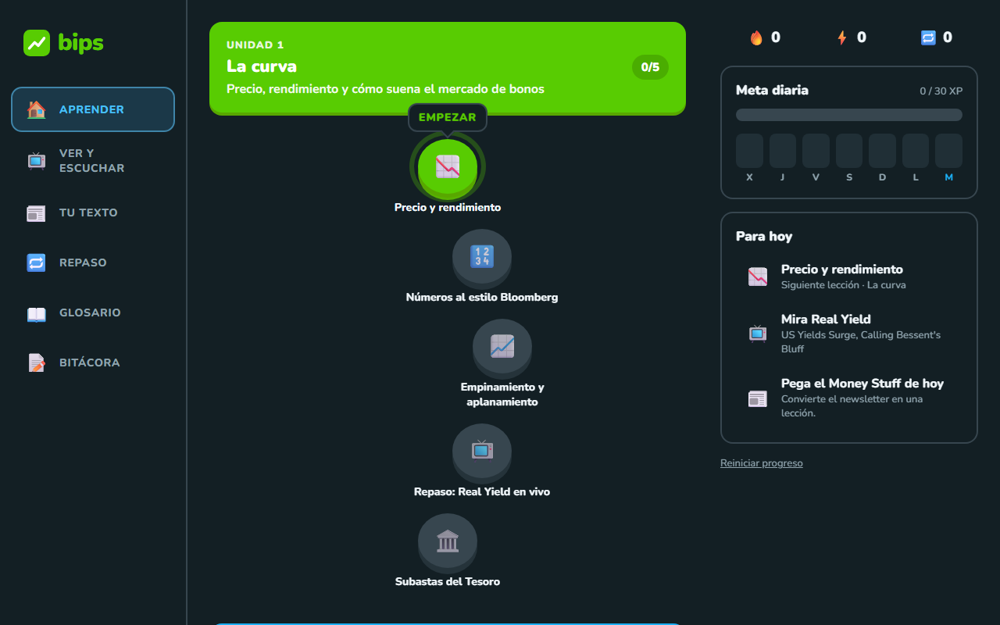
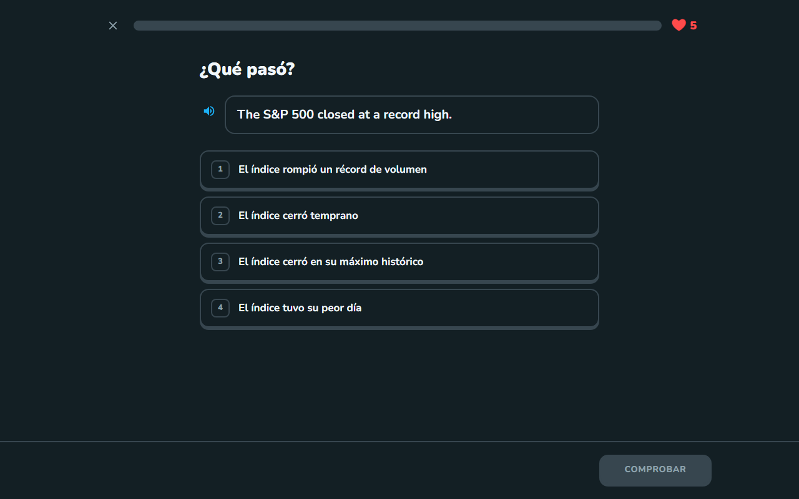
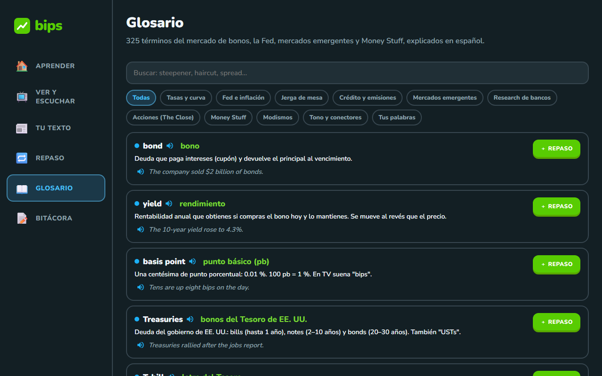

# EnglishForFinance · **bips** 📈

**A Duolingo-style web app for learning the English of macro and bond trading.**

The goal is to be able to follow Matt Levine's *Money Stuff* newsletter and podcast, Bloomberg's free YouTube shows (*Real Yield*, *The Close*), and the EM bond research published by JPMorgan and other banks.

The interface, instructions and explanations are in **Spanish**; everything you learn (quotes, audio, transcripts, glossary terms) is in **English**. The name comes from how TV anchors pronounce *bps*: "bips".

| Learning path | Lesson | Glossary |
|---|---|---|
|  |  |  |

## Features

- **Aprender (Learn).** 6 units, 21 lessons and 176 exercises in six formats: multiple choice, before/after yield-curve charts (name the move: bull steepener, bear flattener…), matching pairs, sentence building with word tiles, listening with a slow-speed button, and typed numbers ("tens at four thirty-two" → 4.32). Hearts, XP, streaks and a daily goal. Wrong answers come back at the end of the lesson.
- **Ver y escuchar (Watch & listen).** Official YouTube embeds of *Real Yield*, *The Close* and the *Money Stuff* podcast, with English captions and 0.75×/1×/1.25× speed. The episode lists update themselves. Transcripts load automatically: click a line to jump there, loop a single sentence, or blur the text to train your ear. You can generate practice exercises from any episode.
- **Tu texto (Your text).** Paste the day's *Money Stuff* email (or a research note, or a news story). Finance jargon, idioms and tone markers (Levine's "Sure… but", "anyway", "I mean") are highlighted. Tap any word to translate or save it, listen by paragraph, and practice with exercises built from that text.
- **Repaso (Review).** Spaced repetition for every term you meet in lessons or save while reading.
- **Glosario (Glossary).** About 325 terms, from *2s10s* and *term premium* to *creditor-on-creditor violence*, explained in Spanish with examples and audio.
- **Bitácora (Log).** Report a wrong correction with 🚩 from any exercise or glossary term. Each report is saved with full context, becomes a post with a status (open / fixed / dismissed) and a comment thread, and can be reviewed and fixed later by Claude.

## Getting started

Requires **Node 18+**. There are no dependencies, so no `npm install`.

```bash
git clone https://github.com/JesusDeSivar/EnglishForFinance.git
cd EnglishForFinance
npm start
```

Open **http://localhost:5173**.

Progress is saved in your browser (`localStorage`). Audio uses the text-to-speech voices built into your system.

### On your phone

```bash
npm run phone
```

This starts the same server, reachable from other devices, and prints the address to open on your phone:

- **Same Wi-Fi:** use the address labelled with your Wi-Fi adapter.
- **From anywhere:** if [Tailscale](https://tailscale.com) is installed on both the computer and the phone, use the `100.x.x.x` address. It works outside your home network, as long as the computer is on.

The first time, Windows may ask whether Node.js can use the network; allow it for private networks.

### The GitHub Pages version

The static copy at **https://jesusdesivar.github.io/EnglishForFinance/** works without a server: lessons, the reader, review and the glossary all work, and the episode lists stay current.

What it can't do is anything that needs the server:
- **Transcripts** don't load automatically. You can still paste them.
- **Bitácora** entries are saved only in that browser.

For those features on your phone, use `npm run phone`.

### Scripts

| Command | What it does |
|---|---|
| `npm start` | App and API on `localhost` only |
| `npm run phone` | Same, reachable from your phone (Wi-Fi or Tailscale) |
| `npm run episodes` | Refresh `data/episodes.json` by hand (a GitHub Action also does it every 6 hours) |

## Course

| Unit | Lessons |
|---|---|
| 1 · La curva | Price & yield · Bloomberg-style numbers · Steepeners & flatteners · Real Yield review · Treasury auctions |
| 2 · La Fed e inflación | Hawks & doves · Inflation & real yields · The press conference |
| 3 · Bonos emergentes | Hard vs local currency · A new issue · Restructuring · Carry & local markets · Reading a strategy note |
| 4 · Research de bancos | Sell-side language · How a trade is written |
| 5 · Leer a Matt Levine | Irony & connectors · Money Stuff vocabulary · Private credit & LMEs |
| 6 · En la mesa y al cierre | Talking like a trader · The Close · Earnings season |

## How it works

- **No build step.** The front end is vanilla ES modules plus CSS. `server.mjs` is a zero-dependency Node server that serves the app and a small JSON API.
- **Text engine** (`js/text.js`). Every glossary alias is compiled into one regular expression, longest match first, so any English text can be highlighted, explained and turned into exercises.
- **Transcripts** (`server/youtube.mjs`). Captions are fetched through YouTube's InnerTube API (Android client), with the watch page and the transcript panel as fallbacks. They're cached in `storage/transcripts/`. Bloomberg TV captions arrive in ALL CAPS and are converted to sentence case, keeping acronyms (CPI, FOMC, EMBI…) and names.
- **Episode lists** (`server/episodes.mjs`). YouTube's RSS feeds are gone, so the latest episodes come from InnerTube:
  - *Money Stuff* comes from its playlist, which is kept newest first.
  - *Real Yield* and *The Close* come from a search inside Bloomberg Television's channel, merged with a search sorted by upload date and ordered by the air date in each title.

  The server serves the list live at `/api/episodes`. For the static site, the [Update episodes](.github/workflows/episodes.yml) workflow rewrites `data/episodes.json` every 6 hours, and only commits when a newer episode appears.
- **Bitácora** (`server/corrections.mjs`). Reports are stored in `storage/corrections.json` with serialized writes. When the server isn't running, the app falls back to storing reports in the browser and asks you to paste transcripts by hand.

### API

| Method | Route | Description |
|---|---|---|
| `GET` | `/api/health` | Health check |
| `GET` | `/api/transcript/:videoId[?refresh]` | English captions for a YouTube video (cached) |
| `GET` | `/api/episodes` | Latest episodes of each show (cached for 1 hour) |
| `GET` / `POST` | `/api/corrections` | List / create log entries |
| `PATCH` / `DELETE` | `/api/corrections/:id` | Update `{ status, note }` / delete |
| `POST` | `/api/corrections/:id/comments` | Add `{ text, by: "you" \| "claude" }` |

The server listens only on `localhost` unless `HOST` is set, because the API writes files.

### Project structure

```
server.mjs              HTTP server + API
server/youtube.mjs      caption fetching and cleanup
server/episodes.mjs     latest episodes per show
server/corrections.mjs  the bitácora store
scripts/update-episodes.mjs  writes data/episodes.json (used by the GitHub Action)
data/lessons.js         units and exercises
data/glossary.js        terms, Spanish explanations, aliases
data/media.js           shows and where their episodes come from
data/episodes.json      latest episodes (generated)
js/app.js               router and home
js/lesson.js            lesson player and exercise types
js/watch.js             YouTube player and interactive transcript
js/read.js              "Tu texto" reader
js/review.js            spaced repetition and glossary
js/log.js · report.js   bitácora page and report dialog
js/text.js              term detection, popovers, generated exercises
js/store.js · api.js    local progress and API client
css/styles.css          design system (light and dark)
```

## Adding content

**A lesson** is an object in `data/lessons.js`:

```js
{ id: 'u1l6', title: 'Mi lección', icon: '📘', ex: [
  { type: 'mc', prompt: '¿Qué significa?', quote: 'Tens are bid.', options: ['…', '…'], answer: 0, terms: ['bid', 'tens'] },
  { type: 'build', prompt: 'La curva se aplanó.', answer: ['The', 'curve', 'flattened'], extra: ['steepened'] },
  { type: 'input', say: 'Twos are down twelve bips.', prompt: '¿Cuántos pb?', numeric: true, answer: 12 },
] }
```

**A glossary term** is a row in `data/glossary.js`: `[id, term, es, definition, aliases, example]`. Once added, it's highlighted automatically everywhere: in lessons, transcripts and pasted texts. Prefix an alias with `=` to make it case-sensitive (`'=Fed'`).

## Content & copyright

- Bloomberg shows are embedded through the official YouTube player. Transcripts are fetched on demand for personal study, cached locally, and excluded from the repo (`.gitignore`).
- *Money Stuff* text is pasted by the user and stays in their browser. It is never bundled with the app.
- All lesson sentences, the sample reading and the glossary examples are original. They're written in the register of these sources, not copied from them.
- This project is not affiliated with Bloomberg, JPMorgan or Matt Levine.

## Roadmap

- [ ] "Explicar con Claude": sentence-by-sentence explanations of pasted text and transcripts (Claude API)
- [ ] More lessons: repo markets, CDS, EM local-market deep dives
- [ ] Progress sync across devices

## License

[MIT](LICENSE) © 2026 Jesus Quevedo
